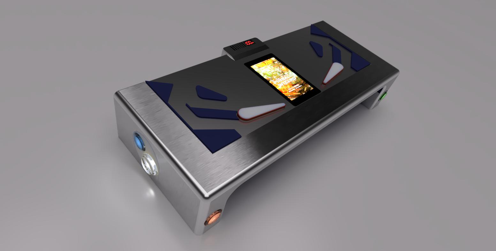

# PINBALL-WIZARD-26-GAMEPAD
This is the home of the great flexible Pinball Controller Pinball Wizard 26 (Work in progress)  

Live Preview work in progress allmost done. (08.04.2026)  

https://a360.co/4cjfFVw  

This is a link to a fusion360 server, you can preview the new model in your browser.  

Software developement for the new MCU has NOT begun. It start next days, after printing.  
Expected Printing time 5 days, with breaks.   

The new hardware platform is the ESP32 P4 + ESP32 C8 for modern bluetooth/wifi communication.  
The middle Part is modular. If you need, you can insert your own Display/Mcu unit.  
